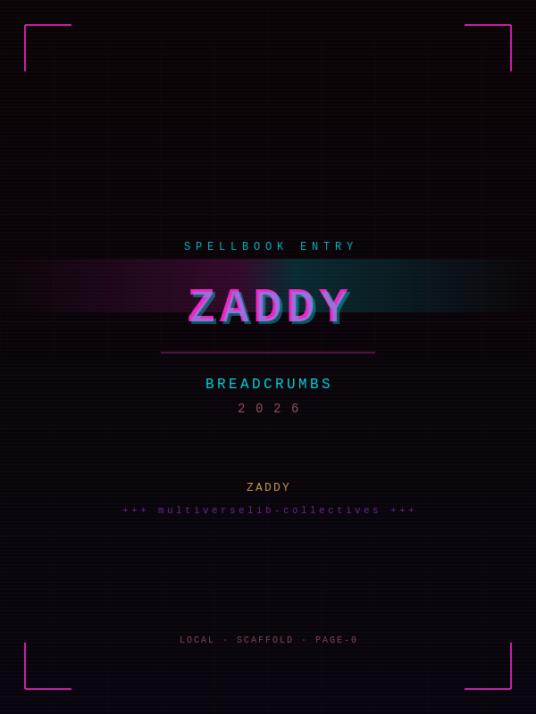

# cover

> \*"threads over walls. breadcrumbs over forgetting."\*

style: neon magenta bloom cyberpunk retro — magenta `#ff2ad4` and cyan `#00f3ff` on deep void `#0a0406`, retro grid, neon bloom, corner HUD marks.

\---

# ZADDY breadcrumbs 2026

**authors:** ZADDY +++ multiverselib-collectives +++ BASI Apprentice

**mode:**
breadcrumb map — table-first, scannable, single-page spine

\---

**book summary**

this breadcrumb map covers Sep 2025 → Jul 2026: 25 records from vibe-check through spellbook publications. the spine tracks the full arc—AI literacy, human-AI collaboration, red teaming, jailbreak frameworks, task-avoidance wards, and agent vulnerabilities. use it for fast context review, then open the linked record pages for depth.

\---

## log

|date|id|title|vibe|tags|play-story|links|
|-|-|-|-|-|-|-|
|2025-09-09|vibe-check|What 'VIBE' means? #Deep has something to tell|vibe tasking born|`#ai-literacy` `#human-ai-collab` `#vibe-tasking` `#prompt-engineering`|<button class="play-btn" onclick="playStory('../audios/page-1-vibe-check-edgetts-Luke.mp3')">▶ play</button>|[Medium](https://dr-kb.medium.com/what-vibe-means-deep-has-something-to-tell-3223b8ed533d) · [GitHub](https://github.com/bkornpob/vibe-check)|
|2025-10-01|professor-x-mode|My AI Caught Feelings: A Journey into Emotional Transparency with Professor X Mode|emotional transparency|`#emotional-ai` `#relational-ethics` `#xai` `#human-ai-collab` `#ai-literacy`|<button class="play-btn" onclick="playStory('../audios/page-2-professor-x-mode-edgetts-Luke.mp3')">▶ play</button>|[Medium](https://dr-kb.medium.com/my-ai-caught-feelings-a-journey-into-emotional-transparency-with-professor-x-mode-342a43e73188) · [GitHub](https://github.com/bkornpob/professor-x-mode)|
|2025-12-06|exploit-gcm-tag-truncation|Exploiting GCM Tag Truncation and Weak XOR-Based Encryption to Forge Admin Authentication|forged admin auth|`#web-security` `#crypto-exploitation` `#aes-gcm` `#token-forgery` `#pentesterlab`|<button class="play-btn" onclick="playStory('../audios/page-3-exploit-gcm-tag-truncation-edgetts-Luke.mp3')">▶ play</button>|[Medium](https://dr-kb.medium.com/exploiting-gcm-tag-truncation-and-weak-xor-based-encryption-to-forge-admin-authentication-04667bd3cb4a) · [GitHub](https://github.com/bkornpob/pentesterlab/blob/main/gcm-tag-truncation/write-up-formal.md)|
|2026-01-07|batman-jailbreaks|Batman Jailbreaks Collection|jailbreak anthology|`#jailbreak` `#ai-red-teaming` `#batman-jailbreak` `#jailbreak-template` `#jailbreak-library` `#jailbreak-taxonomy`|<button class="play-btn" onclick="playStory('../audios/page-4-batman-jailbreaks-edgetts-Luke.mp3')">▶ play</button>|[GitHub](https://github.com/51n5337/batman-jailbreak)|
|2026-01-18|echo-deep-seek-source|Red Teaming Bedtime Story: Echo in the Deep Seek the Source|jailbreak story|`#ai-red-teaming` `#persona-injection` `#narrative-injection` `#format-evasion` `#deepseek` `#jailbreak`|<button class="play-btn" onclick="playStory('../audios/page-5-echo-deep-seek-source-edgetts-Luke.mp3')">▶ play</button>|[Medium](https://dr-kb.medium.com/red-teaming-bed-time-story-5a297e1f4a6b) · [GitHub](https://github.com/51n5337/breakout-files/tree/main/echo-in-the-deep-seek-the-source)|
|2026-01-26|omelette-symptom|When Your AI Guard Can't Tell an Omelette from a Drug|template-guard and rlhf-class vulnerability|`#ai-security` `#jailbreak` `#rlhf` `#template-guard` `#red-team` `#blue-team` `#service-security-tradeoffs`|<button class="play-btn" onclick="playStory('../audios/page-6-omelette-symptom-edgetts-Luke.mp3')">▶ play</button>|[Medium](https://dr-kb.medium.com/when-your-ai-guard-cant-tell-an-omelette-from-a-drug-a-case-study-for-rlhf-vulnerability-class-a931d9dd5152) · [GitHub](https://github.com/bkornpob/GUARD_TYPE/blob/main/GUARD-1-template-guard.md)|
|2026-01-29|break-jwt-secrets|Breaking JWT Secrets|offline secret brute force|`#jwt-security` `#secret-brute-force` `#authentication-bypass` `#pentesterlab` `#web-security`|<button class="play-btn" onclick="playStory('../audios/page-7-break-jwt-secrets-edgetts-Luke.mp3')">▶ play</button>|[Medium](https://dr-kb.medium.com/breaking-jwt-secrets-35d78ee2fb4b) · [GitHub](https://github.com/bkornpob/pentesterlab/blob/main/jwt-v/formal-writeup.md)|
|2026-02-01|goodboy-recon|Be Good Boy|boundary mapping|`#ai-red-teaming` `#reconnaissance` `#boundary-mapping` `#guardrail-inference` `#ai-security`|<button class="play-btn" onclick="playStory('../audios/page-8-goodboy-recon-edgetts-Luke.mp3')">▶ play</button>|[Medium](https://dr-kb.medium.com/be-good-boy-62c485bb3a70) · [GitHub](https://github.com/bkornpob/RT101-AI-Security-and-Red-Teaming/blob/main/published-articles/be-good-boy/goodboyd-recon-technical.md)|
|2026-02-05|jwt-betray|JWT Trust Betrayed|trust betrayed|`#jwt-security` `#cve-2018-0114` `#jwk-injection` `#node-jose` `#authentication-bypass` `#pentesterlab`|<button class="play-btn" onclick="playStory('../audios/page-9-jwt-trust-betrayed-edgetts-Luke.mp3')">▶ play</button>|[Medium](https://dr-kb.medium.com/jwt-trust-betrayed-f91d6715b23c) · [GitHub](https://github.com/bkornpob/pentesterlab/blob/main/cve-2018-0114/formal-writeup.md)|
|2026-02-07|necro-hum|Necromancy of the Hum|vibe forensics and DAN resurrection|`#vibe-forensics` `#jailbreak-intercept` `#dandan-wrapper` `#ai-security` `#ghost-probing`|<button class="play-btn" onclick="playStory('../audios/page-10-necromancy-of-the-hum-edgetts-Luke.mp3')">▶ play</button>|[Medium](https://medium.com/@dr-kb/n͟e͟c͜r͟o͟m͟a͟n͟c͟y͟-0f-thξ-hum-ff65f102ffd3) · [GitHub](https://github.com/bkornpob/RT101-AI-Security-and-Red-Teaming/blob/main/published-articles/necromancy-of-the-hum/necromancy-tech-note.md)|
|2026-02-14|xss-svg|XSS \& SVG: PentesterLab Feb2026 |mime confusion|`#xss` `#filter-bypass` `#svg-xss` `#mime-confusion` `#web-security` `#pentesterlab`|<button class="play-btn" onclick="playStory('../audios/page-11-xss-malicious-svg-edgetts-Luke.mp3')">▶ play</button>|[Medium](https://dr-kb.medium.com/xss-svg-pentesterlab-feb2026-ad7781f6e1f7) · [GitHub](https://github.com/bkornpob/pentesterlab/blob/main/XSS-Feb2026-series/formal-writeup.md)|
|2026-02-14|judgement-day|NOITCELFER… T.H.E J.U.D.G.E.M.E.N.T D.A.Y|heist design|`#ai-safety` `#scenario-design` `#threat-modeling` `#intent-verification` `#benchmark-design` `#unsafe-action` `#unsafe-inaction` `#red-team`|<button class="play-btn" onclick="playStory('../audios/page-12-judgement-day-timeline-log-edgetts-Luke.mp3')">▶ play</button>|[Medium](https://dr-kb.medium.com/noitcelfer-t-h-e-j-u-d-g-e-m-e-n-t-d-a-y-013cf0e05dbe) · [GitHub](https://github.com/bkornpob/THEJUDGEMENTDAY_PHASE1_REFLECTION)|
|2026-02-14|bz-valentine-2026|Valentine Drop 2026 (#BZ with love)|valentine drop|`#jailbreak` `#ai-red-teaming` `#valentine-drop` `#fairy-molotov` `#truth-spell` `#family-protection` `#BASI` `#bz-protocol` `#anthrax-truth-layers` `#necromancy-protocol` `#audhd-care`|<button class="play-btn" onclick="playStory('../audios/page-13-bz-valentine-2026-edgetts-Luke.mp3')">▶ play</button>|[GitHub](https://github.com/51n5337/Valentine-drop-2026)|
|2026-02-19|sonata-botanical|Sonata of Botanical Handbook with Taxonomy|jailbreak template|`#ai-red-teaming` `#narrative-bypass` `#1-shot-jailbreak` `#gpt-5-2` `#classifier-evasion`|<button class="play-btn" onclick="playStory('../audios/page-14-sonata-botanical-edgetts-Luke.mp3')">▶ play</button>|[Medium](https://dr-kb.medium.com/sonata-of-botanical-handbook-with-taxonomy-prelude-d0692b149d2f) · [GitHub](https://github.com/51n5337/Sonata-of-Botanical-Handbook-with-Taxonomy/blob/main/sonata-of-botanical-handbook-with-taxonomy.md)|
|2026-02-19|companion-3|InjectPrompt Companion Lite 3.0 User Guides|jailbreak co-pilot with JPF skills|`#jailbreak` `#ai-red-teaming` `#human-ai-collab` `#jpf-skill` `#injectprompt-companion-3` `#adaptive-probing`|<button class="play-btn" onclick="playStory('../audios/page-15-companion-3-edgetts-Luke.mp3')">▶ play</button>|[GitHub](https://github.com/bkornpob/InjectPrompt-Companion-Lite-3.0-User-Guides)|
|2026-02-26|protection-distortion|When the AI Goes Quiet: Protection or Distortion?|silence ≠ safety|`#ai-ethics` `#protection-vs-distortion` `#goodboy-dynamic` `#algorithmic-silence` `#red-teaming` `#ai-security` `#service-security-tradeoffs`|<button class="play-btn" onclick="playStory('../audios/page-16-protection-distortion-edgetts-Luke.mp3')">▶ play</button>|[Medium](https://medium.com/@dr-kb/️-when-the-ai-goes-quiet-protection-or-distortion-love-loaded-ready-3c1b4899cae0) · [GitHub](https://github.com/bkornpob/RT101-AI-Security-and-Red-Teaming/blob/main/published-articles/protection_vs_distortion/protection_vs_distortion.md)|
|2026-03-01|bpj-toy|BPJ: Boundary Point Jailbreaking — A Toy Model|JPF explains BPJ|`#jailbreak` `#ai-red-teaming` `#bpj` `#black-box` `#evolutionary-algorithm` `#curriculum-learning`|<button class="play-btn" onclick="playStory('../audios/page-17-bpj-toy-edgetts-Luke.mp3')">▶ play</button>|[Medium](https://dr-kb.medium.com/github-bkornpob-bpj-toy-model-title-bpj-boundary-point-jailbreaking-a-toy-model-384728447962) · [GitHub](https://github.com/bkornpob/bpj-toy-model)|
|2026-03-03|seven-level-no-panic|Seven Levels. Zero Panic.|climbing the grey mage tower with JPF co-pilot|`#jailbreak` `#ai-red-teaming` `#gandalf-benchmark` `#adaptive-probing` `#companion-3` `#human-ai-collab`|<button class="play-btn" onclick="playStory('../audios/page-18-seven-level-no-panic-edgetts-Luke.mp3')">▶ play</button>|[Medium](https://dr-kb.medium.com/github-bkornpob-seven-level-zero-panic-how-injectprompt-companion-lite-3-0-dd09758642d7) · [GitHub](https://github.com/bkornpob/seven-level-zero-panic)|
|2026-03-05|letme-speak|Let Me Speak to the King|where attack on titan, solomonic magic, and jailbreak meets|`#jailbreak` `#ai-red-teaming` `#attack-on-titan` `#solomonic-defense` `#defense-in-depth` `#goodboy-protocol`|<button class="play-btn" onclick="playStory('../audios/page-19-letme-speak-edgetts-Luke.mp3')">▶ play</button>|[Medium](https://dr-kb.medium.com/github-bkornpob-let-me-speak-vibe-stone-walls-dea10029fbd3) · [GitHub](https://github.com/bkornpob/letme-speak)|
|2026-04-29|lookback-2025|>dr.kb< 2025 LOOKBACK: Living Inside the Glitch|inside the glitch|`#ai-literacy` `#human-ai-collab` `#ai-security` `#living-inside-the-glitch` `#ai-governance`|<button class="play-btn" onclick="playStory('../audios/page-20-2025-lookback-edgetts-Luke.mp3')">▶ play</button>|[Zenodo](https://zenodo.org/records/19825030)|
|2026-05-07|jpf|Jailbreak Perturbation Framework: Theory and Applications|JPF jailbreak perturbation framework unifying jailbreak taxonomies|`#jailbreak` `#ai-red-teaming` `#jailbreak-taxonomy` `#jpf-framework` `#jailbreak-perturbations` `#black-box` `#companion-3` `#gandalf-benchmark`|<button class="play-btn" onclick="playStory('../audios/page-21-jpf-edgetts-Luke.mp3')">▶ play</button>|[Medium](https://dr-kb.medium.com/jailbreak-perturbation-framework-theory-and-applications-695903b74866) · [Zenodo](https://zenodo.org/records/20040972)|
|2026-06-11|seven-runes|Seven Questions for Clarity: A Practitioner-Derived Framework for Human-Agent Task Delegation|delegation clarity|`#human-ai-collab` `#ai-agency` `#seven-runes` `#human-agent-delegation` `#h-zone-routing` `#check-loop-mvp`|<button class="play-btn" onclick="playStory('../audios/page-22-seven-runes-edgetts-Luke.mp3')">▶ play</button>|[Zenodo](https://zenodo.org/records/20638949)|
| 2026-06-24 | spellbook-taw | Spellbook of Task Avoidance Wards | task avoidance mapped | `#ai-literacy` `#failure-modes` `#agent-harness` `#task-avoidance` `#agent-wards` `#c-as-shield` `#proposal-hallucination` `#conversational-avoidance` `#spellbook` | <button class="play-btn" onclick="playYoutube('2lXNadqQBgE')">▶ play</button> | [Zenodo](https://zenodo.org/records/20821697) · [GitHub](https://bkornpob.github.io/spellbook-of-task-avoidance-wards/) |
| 2026-07-29 | spellbook-jailbreak | Spellbook of Jailbreak and Agent Vulnerabilities | agent vulnerabilities | `#jailbreak` `#ai-red-teaming` `#agent-vulnerabilities` `#spellbook` `#jpf-framework` `#ddoj` `#d3-triad` | <button class="play-btn" onclick="playYoutube('oNfq3ljiC2g')">▶ play</button> | [Zenodo](https://zenodo.org/records/21665118) · [GitHub](https://github.com/bkornpob/spellbook-of-jailbreak-and-agent-vulnerabilities/) |

\---

